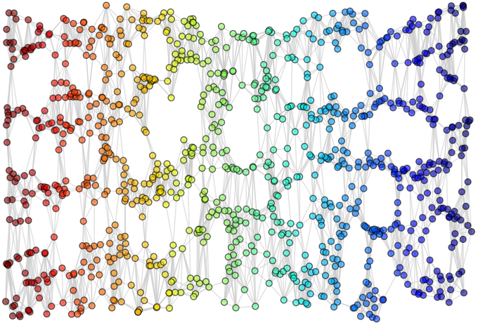

# [Manifold Learning](http://github.com/lucasdavid/manifold-learning)

Implementation for final report at Universidade Federal de São Carlos:
"A Study of The Isomap Algorithm and Its Applications in Machine Learning", 2015 ([paper](https://repositorio.ufscar.br/handle/ufscar/14806)).

This project aims to study the foundations of nonlinear dimensionality reduction with the algorithm
known as Isometric Mapping (or simply Isomap) and observe the application of the algorithm in practical
experiments.

Experiments were conducted on a linux Ubuntu 15.10 64 bits machine,
with a Intel Core i7-4700MQ CPU 2.40GHz × 8, and 16 GB of RAM.
Please refer to the [experiments](experiments) folder for details.
